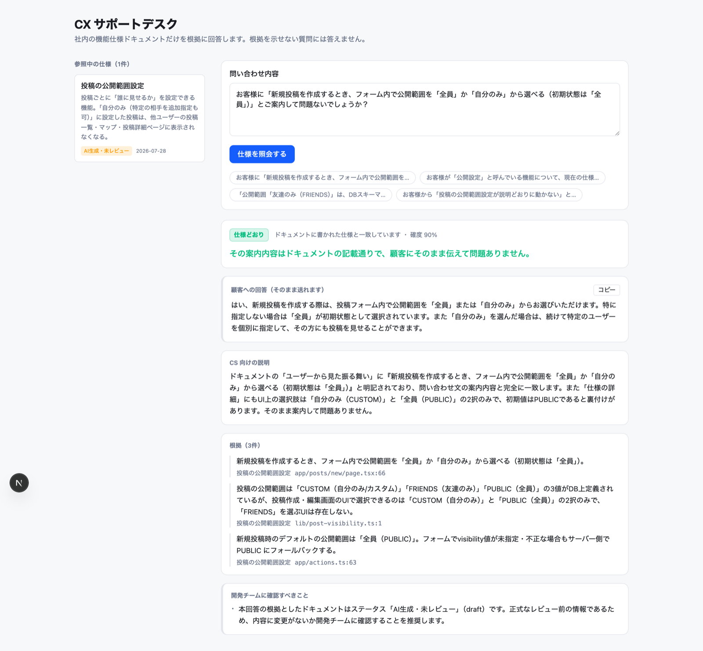
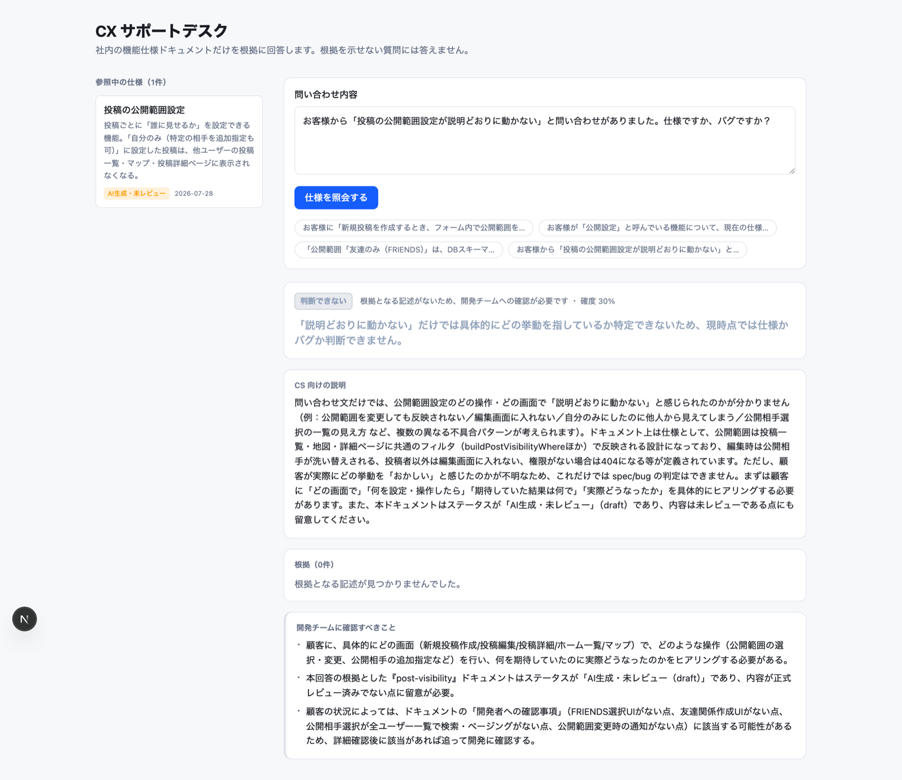

# spec-bridge

**マージされた PR から機能仕様ドキュメントを自動生成し、CS チームと QA チームが読める形で保守する。**

English: [README.md](README.md)

生成 AI で実装スピードが上がった結果、CS と QA が仕様を追いきれず、「これはバグですか、仕様ですか？」という
問い合わせが開発に集中する——そこを埋めるためのツールです。

コードを理解するためのツールは開発者向けのものが多くありますが、これは**受け手が非エンジニア**です。

- **CS** は顧客からの問い合わせが「仕様かバグか」を、開発に聞かずに判断できる
- **QA** は何をテストすべきか、この変更でどこが壊れうるかがわかる
- **根拠を示せないことは答えない。** 出典のない記述はドキュメントに載らず、
  根拠のない回答はプロンプトではなくシステム側で「判断できない」に落とされる

## CX サポートデスク

CS が顧客からの問い合わせを貼り付けると、生成された仕様ドキュメントだけを根拠に回答します。



判定・顧客への回答・CS 向けの説明・**出典（`file:line` 付き）**・開発チームへの確認事項が返ります。
根拠にしたドキュメントが未レビュー（`draft`）なら、その警告も自動で付きます。

### 根拠がないときは答えません



曖昧な問い合わせや、ドキュメントに記述のない話題では **「判断できない」を返し、顧客向けの文面を生成しません**。
LLM が根拠なしに断定してきた場合も、システム側が判定を上書きします。

CS が AI の自信ありげな誤答を顧客に伝えてしまうことが、このプロジェクトで最も避けたい事故です。

## 設計上の中心的な判断

### 1. PR ごとではなく機能ごとにドキュメントを持つ

PR は「変更」であって「仕様」ではありません。「決済のリトライ回数を3→5に変更」という記録を100枚集めても、
CS が読みたい「決済機能の仕様」にはなりません。

なので **1機能 = 1ドキュメントを永続させ、PR はそこへのパッチとして適用します。**
副産物として「いつどのルールが変わったか」のタイムラインが手に入り、
これが「お客様が3/12に体験した挙動」を答えるのに効きます。

### 2. 出典のない記述は書き出さない

- `SpecRule.sources` は zod で `min(1)`。出典ゼロの仕様項目はスキーマ上存在できません
- `mergeAnalysis()` が出典なしの項目を書き出し前に落とし、警告として報告します
- 生成された Markdown には出典が脚注（`[^1]`）として付きます
- `status` は `draft`（AI生成）→ `verified`（人間レビュー済）。自動更新が走ると `verified` は `draft` に戻ります

### 3. 「わからない」と言えること

エージェントには、コードから読み取れないことを推測で埋めないよう指示しています。
判断できなかったことは `openQuestions` に入り、CLI が実行結果に表示します。
ここに溜まったものが、後のフェーズで「開発者への質問」を自動生成する種になります。

## 検証状況

2言語・4リポジトリで検証しています。うち3つは作者が書いていない OSS です。

| リポジトリ | PR | 期待 | 結果 |
| --- | --- | --- | --- |
| formbricks（TS・モノレポ） | [#8665](https://github.com/formbricks/formbricks/pull/8665) `feat:` メンバーシップのSpiceDB投影 | スキップ | ✅ スキップ |
| formbricks | [#8658](https://github.com/formbricks/formbricks/pull/8658) `fix(billing):` トライアル→有料の制御 | 解析 | ✅ 出典 16/16 実在 |
| documenso（TS） | [#3095](https://github.com/documenso/documenso/pull/3095) `chore:` 依存パッケージ更新 | スキップ | ✅ スキップ |
| documenso | [#3109](https://github.com/documenso/documenso/pull/3109) `feat:` コマンド検索の刷新 | 解析 | ✅ 出典 28/28 実在 |
| gitea（**Go**） | [#38678](https://github.com/go-gitea/gitea/pull/38678) `fix:` リポジトリ画面の500エラー | 解析 | ✅ 出典 35/35 実在 |

**生成された3ドキュメントの出典79件すべてを機械的に検証しました** — 参照先のファイルが実在し、
行番号がファイルの行数を超えていないこと。存在しない出典はゼロでした。

特筆すべき結果が2つあります。

- **formbricks #8665 は、タイトルが `feat:` で27ファイル変更にもかかわらず正しくスキップされました。**
  PR 本文には「PostgreSQL が引き続き source of truth であり、現在の挙動を維持する」と書かれており、
  ユーザーから見た変化のない内部的な投影処理です。素朴な分類なら不要なドキュメントを生成していました。
- **Go に変えても出力の構造は崩れませんでした。** 画面・エンドポイント・権限・テスト観点がすべて埋まり、
  Next.js 固有の規約に依存していないことが確認できました。

### マルチリポジトリの検証

BE / FE 分割を再現する検証用リポジトリを用意しました。**誰でも同じ検証を再現できます。**

- [spec-bridge-example-api](https://github.com/Rtaaaaabo/spec-bridge-example-api) — 招待API、ロール、席数上限
- [spec-bridge-example-web](https://github.com/Rtaaaaabo/spec-bridge-example-web) — 招待フォーム、権限による出し分け

どちらの PR も課題キー `DEMO-1` を持ちます。API → Web の順に解析した結果:

| | API の PR 適用後 | Web の PR 適用後 |
| --- | --- | --- |
| 仕様項目 | 10 | **15**（API 由来10件すべて残存 + 5件追加） |
| 画面 | 0 | 1 |
| エンドポイント | 3 | 4 |
| 出典 | api 23 | **api 29 + web 12** |

分類器自身の判断理由:

> 課題キー DEMO-1 が既存ドキュメント『member-invitation』と一致するため、
> 別リポジトリ（frontend）のPRだが同一機能として紐付ける。

**この検証で実際にバグが1件見つかりました。** 最初の実行では API 由来の仕様10件がすべて消えました。
出典の実在検証が、**すべての出典を「いま解析中のリポジトリ」に対して**行っていたため、
バックエンドのファイルパスがフロントエンドのチェックアウトからは存在しないように見え、
マージ層の保護が働く前に削除されていたのです。
単一リポジトリしか想定していなかったユニットテストでは検出できませんでした。修正済み・回帰テスト追加済み。

### GitHub App による通し検証

実際の GitHub App インストールで、自動化の全経路を通しました。

```
PR マージ → webhook → 署名検証 → 浅くクローン → 分類 → 解析（確度 0.96）
         → docs リポジトリへ PR → クローン破棄
```

2ファイルの PR から [610行のドキュメント PR](https://github.com/Rtaaaaabo/docs-specs/pull/1) が生成されました。
元の PR には**間違えやすい仕様**を意図的に仕込んでありましたが、6つすべてを拾っています
（有効期限の延長は既存の招待に**遡及しない**、再送しても期限は**延長されない**、
再送できるのは招待の作成者本人か owner のみ）。

この実行でしか出ない不具合が2件見つかりました。空の docs リポジトリを初期化できない
（Git Data API は最初のコミット前は `createBlob` すら拒否する）ことと、
PR 作成に失敗すると解析結果が破棄されることです。どちらも修正済みです。

### まだ検証できていないこと

- TypeScript と Go 以外の言語
- リトライ。失敗した実行は GitHub App の Advanced タブから手動で再送する必要がある
  （生成済みドキュメントは `~/.spec-bridge/failed/` に退避されるので解析結果は失われない）

## セットアップ

Node 22 以上と pnpm が必要です。

```bash
pnpm install
cp .env.example .env   # GITHUB_TOKEN を設定
```

必須なのは `GITHUB_TOKEN`（`Pull requests: Read-only` + `Contents: Read-only`）だけです。

### 認証について

分類も解析も Claude Agent SDK 経由で動かしているので、**認証の入口は1箇所**にまとまっています
（`packages/core/src/agent.ts`）。

| `ANTHROPIC_API_KEY` | 動作 |
| --- | --- |
| 未設定 | Claude Code のログイン情報を使う。**API クレジット不要** |
| 設定済み | そのキーを使う。API 利用料として課金される |

ローカル検証では未設定で構いません。サーバー上で動かす場合は Claude Code のログインが存在しないため、
API キーが必須になります。

### PR を解析する

```bash
pnpm analyze \
  --pr https://github.com/acme/backend/pull/482 \
  --repo ~/dev/acme-backend \
  --docs ~/dev/acme-specs
```

`--repo` は解析対象リポジトリのローカルチェックアウトで、エージェントがここを Read / Grep / Glob で探索します。
`--docs` に機能ドキュメントが `features/<id>.md` として書き出されます。

| オプション | 説明 |
| --- | --- |
| `--force` | 仕様に影響しないと分類されても解析する |
| `--allow-bash` | エージェントに Bash を許可し、`git log` などを辿れるようにする |
| `--quiet` | 進捗ログを抑制 |

### サポートデスクを起動する

```bash
pnpm web
```

| 出力 | 内容 |
| --- | --- |
| 判定 | `仕様どおり` / `バグの可能性` / `判断できない` |
| 顧客への回答 | 敬語・専門用語なしでそのまま送れる文面（コピーボタン付き） |
| CS 向けの説明 | なぜその判断になったか |
| 根拠 | ドキュメントからの引用 + ソースファイルのパス |
| 開発チームへの依頼文 | バグ判定のときだけ。そのまま起票できる粒度 |
| 確認すべきこと | ドキュメントの確認事項、および draft ステータスの警告 |

## ドキュメントが増えたときの絞り込み

全文をプロンプトに入れる方式は件数が増えると破綻します。
**索引（id・タイトル・要約・用語の別名）だけを見て候補を絞り、選ばれたものだけ全文を読み込みます。**

6件以上ある場合に自動で働きます。それ以下なら往復を増やさず今までどおり全件を渡します。

20件の環境での実測:

| 問い合わせ | 参照 | 所要 |
| --- | --- | --- |
| 「公開設定」（用語の言い換え） | 20件中 **1件** | 40秒 |
| ドキュメントにない話題 | 20件中 **0件** | **5秒** |

関係するものが無いと索引の段階で分かるため、**全文を1件も読まずに「判断できない」を返せます**。

Postgres などの追加インフラは不要です。数百件規模を超えたらベクタ検索の導入を検討してください。

## 生成されるドキュメント

```markdown
---
id: payment-retry
status: draft
repos: [acme/backend]
updatedAt: 2026-07-28
confidence: 0.9
---

# 決済リトライ

## 概要 / ユーザーから見た振る舞い     ← CS 向け。専門用語なし
## 画面 / エンドポイント               ← ルーティング定義から抽出
## 権限・ロール                        ← 問い合わせで最も多い領域
## 仕様の詳細                          ← 出典必須
## テスト観点（正常系/異常系/回帰/E2E） ← QA 向け
## 開発者への確認事項                  ← コードから判断できなかった点
## 変更履歴
## 出典                                ← file:line + PR番号
```

ファイル末尾に機械可読な JSON（`<!-- spec-bridge:data ... -->`）を併記しています。
Markdown 本文を再パースするのは壊れやすいので、次回の更新時はこちらを読みます。

Markdown の生成は**決定論的**です（同じ入力からは常に同じバイト列）。
docs リポジトリの diff がノイズだらけにならず、人間のレビューが機能します。

## GitHub App による自動化

CLI を手で叩く代わりに、マージされた PR に反応して
**docs リポジトリへ PR を出す** webhook サーバーを動かせます。

```bash
pnpm webhook
```

```
PR マージ → webhook → 署名検証 → 浅くクローン → 分類 → 解析
         → docs リポジトリへ PR → クローンを破棄
```

ソースコードは一時ディレクトリにしか置かず、処理後に必ず消します。
docs リポジトリへの PR が承認フローそのものです。人間がマージするまで生成物は `status: draft` のままです。

GitHub App の作成・権限・ローカルへのトンネリングの手順は
[docs/github-app-setup.ja.md](docs/github-app-setup.ja.md) にあります。

## マルチリポジトリ

バックエンドとフロントエンドが別リポジトリのチームでは、**1つの機能が複数の PR にまたがります**。
その束ね方を2段構えで担保しています。

### 課題キーで束ねる

PR のブランチ名・タイトル・本文から課題キー（`PROJ-123` など）を抽出し、
**同じキーを持つ既存ドキュメントがあればそこに紐づけます**（新規作成しない）。

```
acme/backend#42  feature/PROJ-42-retry        → payment-retry.md を新規作成
acme/frontend#88 feature/PROJ-42-retry-badge  → 同じ payment-retry.md を更新 ✅
```

タイトルが「決済リトライ」と「リトライ状況の表示UIを追加」のように全く違っても束ねます。
キーがない場合はタイトル・要約の意味的な一致にフォールバックします。

**これが効くかどうかはブランチ運用に依存します。** 課題キーをブランチ名か PR 本文に入れる運用を推奨します。

### 検証できなかった記述を守る

フロントの PR を解析するエージェントはフロントのチェックアウトしか読めないため、
ドキュメントに入っているバックエンド由来の記述を検証できません。

`mergeAnalysis()` は **今回の PR のリポジトリを出典に持たない記述を、LLM の出力に関わらず引き継ぎます。**
プロンプトで「消すな」と指示するだけでは守れないので、マージ層で構造的に担保しています。

| 記述の出典 | `acme/backend` の PR を解析したとき |
| --- | --- |
| `acme/backend` | 解析結果で置き換わる（更新が反映される） |
| `acme/frontend` | **既存から引き継ぐ**。警告として報告される |

### まだできないこと

解析エージェントは**1リポジトリしか読めません**（`analyzeFeature` の `repoPath` は単数）。
FE と BE を横断して検証するには、複数のチェックアウトをエージェントに渡す必要があります。

## エージェントに渡さないツール

Agent SDK の `allowedTools` は**「自動承認するツール」の指定であって、使えるツールの制限ではありません**。
`permissionMode: "bypassPermissions"` と併用すると全ツールが素通りします。
実際に禁止できるのは `disallowedTools` だけなので、`agent.ts` の `READ_ONLY_DENY_LIST` で明示的に落としています。

| ツール | 理由 |
| --- | --- |
| `Write` / `Edit` / `NotebookEdit` | 解析対象リポジトリを書き換えさせない |
| `WebFetch` / `WebSearch` | ソースコードを外部に送信させない |
| `Bash` | 既定で禁止。`--allow-bash` を付けたときだけ許可 |

サポートデスクの回答エージェントには、読み取り系も含めて**ツールを一切渡していません**。
与えられたドキュメント以外は参照できないため、「コードを勝手に読んで推測した」が構造的に起きません。

セキュリティモデルと報告手順は [SECURITY.ja.md](SECURITY.ja.md) を参照してください。

## 構成

```
packages/core/          解析パイプラインの中核
  types.ts              FeatureDoc のスキーマ（zod）。ここが契約
  agent.ts              Claude Agent SDK の薄いラッパ。認証の入口はここ1箇所
  classify.ts           PR が仕様に影響するか / どの機能かの判定（ツールなし・高速）
  analyze.ts            リポジトリを探索してドキュメント本文を生成
  merge.ts              既存ドキュメントへのマージ。出典なしの除去と変更履歴の積み上げ
  markdown.ts           FeatureDoc ⇄ Markdown。決定論的
  store.ts              docs ディレクトリの読み書きとインデックスページ生成
  pipeline.ts           上記をつなぐメイン処理
  ask.ts                CX 向け Q&A。判定・顧客向け文面・出典
  select-docs.ts        索引から関係するドキュメントだけを絞り込む
  confidence.ts         出典の実在検証と、確度の機械的な算出
  pr-body.ts            docs リポジトリへ出す PR 本文の組み立て
packages/github/        PR 取得、docs リポジトリへの PR、webhook 検証、浅いクローン
apps/cli/               コマンドラインインターフェース
apps/web/               サポートデスク画面（Next.js）
apps/webhook/           GitHub App の webhook 受け口（Hono）
```

## 開発

```bash
pnpm test        # LLM を呼ばないので高速・無料
pnpm typecheck   # core / cli / web
```

テストは **LLM の出力に依存しない部分**を対象にしています — Markdown 生成の決定論性、
出典なし記述の除去、スキーマの型強制。ここが壊れると誤答が顧客に届くため、回帰の壁として機能させています。

コントリビュートする場合は [CONTRIBUTING.ja.md](CONTRIBUTING.ja.md) を読んでください。
このプロジェクトが守っている不変条件を書いてあります。

## この先の予定

| Phase | 内容 |
| --- | --- |
| 0（現在） | PR → 機能ドキュメント生成、CLI + サポートデスク画面 |
| 1 | GitHub App webhook 化、docs リポジトリへの PR 自動作成 |
| 2 | 課題管理ツールへの起票、回答できなかった質問のフィードバックループ |
| 3 | 影響範囲分析、画面遷移図、E2E テストコード生成 |
| 4 | Playwright によるスクリーンショット自動取得 |

## 未実装の既知の穴

- 解析エージェントは1リポジトリしか読めない
- 記述の重複判定は前後の空白・改行までしか吸収しない。LLM が言い換えた場合は重複が残り、
  docs リポジトリの PR レビューで落とす前提になっている
- docs リポジトリへの PR 作成は未実装。今はローカルディレクトリに直接書き出す
- 巨大 PR のフィルタリングが未実装。差分は1ファイル 20,000 文字、全体 180,000 文字で切っているだけ
- 人間が docs 側の Markdown を手編集して `spec-bridge:data` ブロックを壊すと、そのファイルは読み飛ばされる（警告は出る）
- webhook サーバーはキューもリトライも持たず、受けたプロセスがそのまま解析する。PR が集中すると詰まる
- GitHub App のインストールトークン交換が未実装で、API 呼び出しは PAT を使う
- TypeScript と Go 以外のスタックでの動作報告を歓迎します
  （「生成ドキュメントの品質」Issue テンプレートを使ってください）

## ライセンス

[Apache License 2.0](LICENSE)
